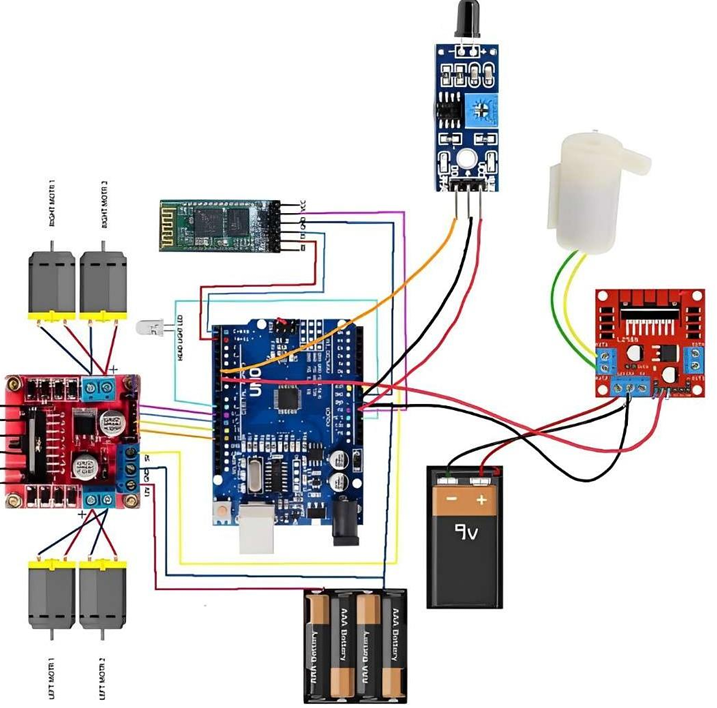
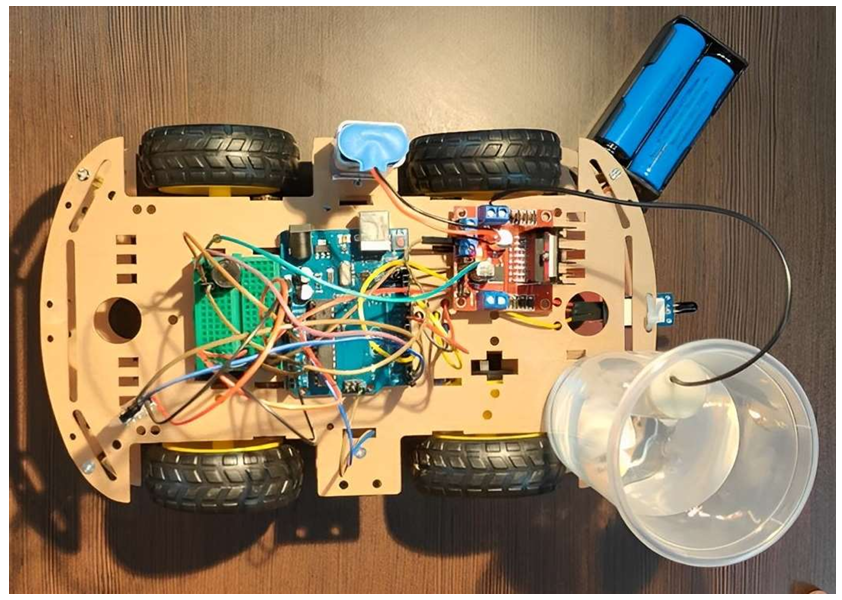
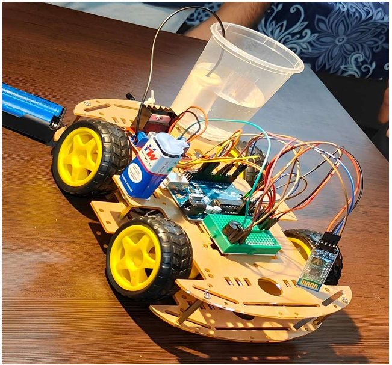
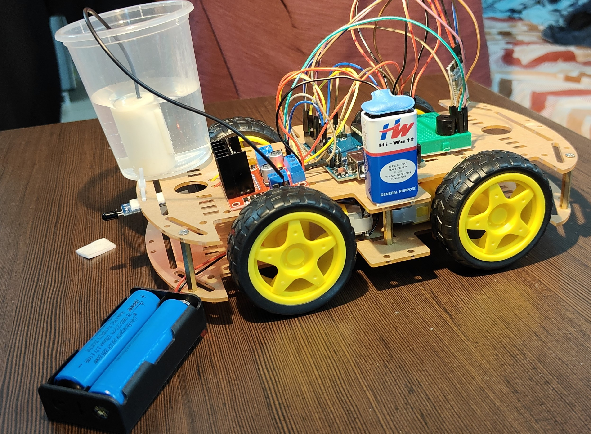

# Firefighting Robot Project

A remote-controlled car equipped with fire detection sensors, an alarm system, and a water delivery mechanism designed to combat fires efficiently and cost-effectively. 

## Table of Contents

- [Need of the Project](#need-of-the-project)
- [Novelty](#novelty)
- [Circuit Diagram](#circuit-diagram)
- [Implementation](#implementation)
  - [Hardware Setup](#hardware-setup)
  - [Software Setup](#software-setup)
- [Images](#images)
- [Demo](#demo)
- [Functionality](#functionality)
- [Key Learnings](#key-learnings)
- [Getting Started](#getting-started)
- [Contribution](#contribution)

## Need of the Project

The need for this firefighting robot project stems from the demand for an accessible and efficient solution to combat fires. Traditional firefighting methods often face challenges in reaching certain areas or dealing with hazardous environments. By introducing a remote-controlled car design with fire detection sensors, an alarm system, and a water delivery mechanism, this project addresses the need for a versatile and cost-effective tool. It enables firefighters to swiftly respond to fire incidents, navigate difficult terrains, and deliver targeted firefighting measures, ultimately improving safety outcomes and minimizing property damage.

## Novelty

Our firefighting robot project is highly useful because it offers a practical and cost-effective solution for fighting fires. Unlike other complex robotic systems, our robot is designed as a remote-controlled car with fire detection sensors, an alarm system, and a water delivery mechanism. This simplicity allows for easy operation by firefighters, while its mobility and quick response enable it to navigate through different environments and reach fire incidents swiftly. The robot's versatility makes it suitable for a wide range of firefighting scenarios. By providing an accessible and complementary tool, our project enhances firefighting capabilities, improves response times, and helps protect lives and property effectively.

## Circuit Diagram

Refer to the circuit diagram in the project files for detailed wiring instructions.


## Implementation

### Hardware Setup

1. Connect the four motors to L298 and connect the water pump to the other L298 module.
2. The L298 connected to the motors is powered by a 9V battery, and the other L298 module is connected to another 9V battery.
3. Connect the L298 module (connected to motors) to the Arduino UNO and GND.
4. Connect the motor pins to the digital pins of Arduino UNO.
5. Connect the digital output of the flame sensor to the Arduino, and connect VCC and GND to respective pins.
6. Connect the buzzer to the L298 module and the digital pin of Arduino through the breadboard connected to the water pump.
7. Connect the TXD of the Bluetooth module to the RX of Arduino and the RXD of the Bluetooth module to the TX of Arduino.
8. Connect the VCC and GND of the Bluetooth module to the respective positions in the breadboard.
9. Connect the water pump to the L298 module placed in the upper layer of the robot.
10. Connect a wire from the buzzer to IN1 of the L298 module placed in the upper layer.

### Software Setup

1. Install the Arduino IDE and create a new sketch.
2. Define the pin configurations for the buzzer and flame sensors.
3. Set up the required pins in the `setup()` function.
4. Use the Bluetooth module for communication between the robot and the mobile phone.
5. Based on the buttons clicked on the mobile phone, the Bluetooth module will receive the signal.
6. Based on the received signal, the code will toggle between HIGH and LOW.
7. By default, `Flame=HIGH`. If the fire is detected, `Flame` will be equal to LOW, which will toggle the `buzzerPin` to HIGH.

## Images




## Demo
**Project Demo:** [View the demo video](https://youtu.be/nHF-pKGtQJA)


## Functionality

1. Use the Arduino Car app, available on the App Store/Play Store, to control the movement of the car.
2. The car continuously checks for fire using a fire sensor.
3. Once the fire is detected, the sensor sends a signal to Arduino.
4. Arduino then sends the signal to the L298 driver, which amplifies the signal to the buzzer and the pump.
5. The buzzer rings the alarm to alert the locality.
6. The water pump applies pressure on the tank, causing water to come out of the straw to extinguish the fire.

## Key Learnings

- **Hardware Integration:** Understanding the specifications, compatibility, and connections of various hardware components such as Arduino Uno, L298N motor drivers, wheels, water pump, and Bluetooth module.
- **Sensor Integration and Data Acquisition:** Learning how to connect and integrate sensors with Arduino to receive environmental data and make decisions based on it.
- **Motor Control:** Using the L298N motor drivers to control the movement of the robot's wheels and understanding PWM principles.
- **Safety Considerations:** Ensuring electrical components are adequately insulated and protected, preventing short circuits, and implementing fail-safe measures.
- **Project Management:** Enhancing teamwork, coordination, and communication skills.
- **Real-World Application:** Demonstrating the potential of robotics, IoT, and automation in solving real-world problems such as firefighting.

## Getting Started

### Prerequisites

- Arduino IDE
- Basic knowledge of electronics and programming

### Installation

1. Clone the repository:
   ```bash
   git clone https://github.com/Vamsi-Krishna002/Fire-Fighter-Robot.git
   ```
2. Open the Arduino IDE and load the sketch(code.ino) from the repository.
3. Follow the hardware setup instructions to assemble your robot.

### Running the Project

1. Upload the sketch to your Arduino UNO.
2. Open the Arduino Car app on your mobile phone.
3. Pair your phone with the Bluetooth module on the robot.
4. Use the app to control the robot and monitor fire detection status.

## Contribution

If you have any suggestions or improvements, feel free to create a pull request or open an issue.

